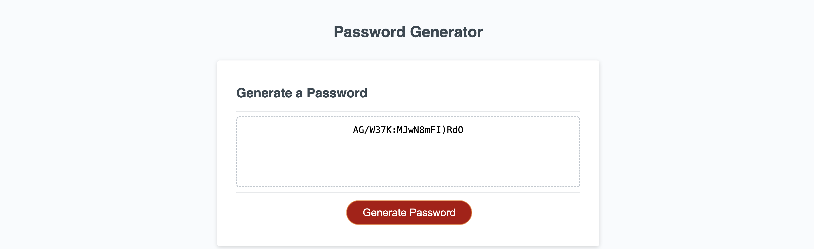

## Description

This is a simple JavaScript-based password generator. Users can customize the password by specifying the length and selecting the types of characters to include (lowercase, uppercase, numbers, and special characters).

## How to Use

1. Open the `index.html` file in a web browser.

2. Click the "Generate Password" button to start the process.

3. Answer the prompts to specify the desired password length and character types.

4. The generated password will be displayed in the designated area.

## Features

- Customizable password length between 8 and 128 characters.
- Options to include lowercase and/or uppercase letters, numbers, and special characters.

## Files

- `index.html`: HTML file for the user interface.
- `script.js`: JavaScript file containing the password generation logic.
- `style.css`: CSS file for styling the user interface.

## Example

## Contributions

Contributions are welcome! Feel free to submit issues or pull requests.

## License

This project is licensed under the [MIT License](LICENSE).
